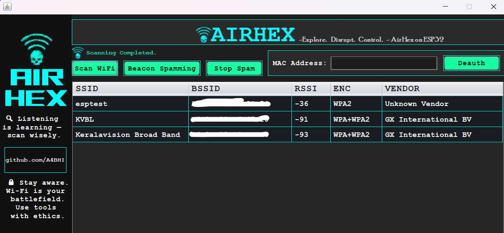

# 💻 AirHex – ESP32 Wi-Fi Beacon Spammer & Scanner

**AirHex** is a beginner-friendly project combining an **ESP32 microcontroller** and a **Java Swing desktop app** to perform basic Wi-Fi scanning and beacon spamming. This project showcases how embedded systems can interact with desktop applications over HTTP.

> ⚠️ **For educational and ethical hacking purposes only.**

---

## 📸 GUI Preview

  
*Sample screenshot of the Java Swing application UI.*

---

## 🧠 Features

- **Java Swing Interface**  
  A lightweight and interactive desktop client to communicate with the ESP32.

- **Wi-Fi Network Scanner**  
  Displays a list of nearby Wi-Fi networks including SSID, MAC address, signal strength, and encryption type.

- **Beacon Spammer**  
  Sends fake Wi-Fi beacon frames to clutter the airspace with spoofed SSIDs.

- **Deauther (UI Option)**  
  The UI includes a **Deauther** option, but due to hardware limitations of the ESP32 used in this project, **deauthentication is not implemented** in the backend.

---

## 🚀 How It Works

1. The ESP32 connects to a Wi-Fi hotspot and hosts a simple web server with endpoints:
   - `/scan` – scans nearby Wi-Fi networks
   - `/start` – starts beacon spam
   - `/stop` – stops beacon spam

2. The Java Swing application:
   - Sends HTTP GET requests to the ESP32
   - Displays the scanned networks in a table
   - Provides a button to trigger spam mode

---

## ⚙️ Requirements

### Java GUI
- Java JDK 8+
- Swing (included in JDK)

### ESP32
- ESP32 Dev Board
- Arduino IDE with ESP32 board support
- Required libraries: `WiFi.h`, `WebServer.h`, `esp_wifi.h`

---
## 🔧 Future Updates

- 🌐 **Web UI Support**  
  A full-featured web interface is in development to control AirHex from any **mobile** or **PC browser**.

- 💥 **Deauther Feature**  
  If a supported ESP32 variant is available, full deauthentication attack support will be added.

---
## ⚠️ Disclaimer

This project is created for **learning, testing, and ethical cybersecurity research** only.  
Do **not** use this project on networks without **explicit permission**.

---

## 👨‍💻 Author

Made with 💡 by Abhijith H Nair
Feel free to contribute or fork this project on GitHub!

